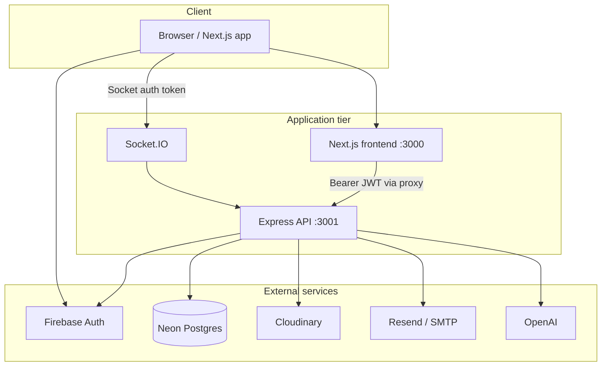

Security

# Launchpad ERP — Security Posture

This document describes **implemented** security controls for the Launchpad ERP system, with pointers to concrete evidence (code, tests, CI, manual QA guides). It is intended for CISO review, InfoSec walkthroughs, and auditors.

**Last updated:** 2026-06-23

---

## 1. Overview

Launchpad ERP is an internal HR and people-operations platform. It handles:


| Data class       | Examples                                                                          | Sensitivity |
| ---------------- | --------------------------------------------------------------------------------- | ----------- |
| Employee PII     | Name, address, birthday, emergency contact, government IDs (SSS, TIN, PhilHealth) | High        |
| HR documents     | NBI clearance, government ID scans, medical certificates                          | High        |
| Performance data | Evaluations, supporting PDFs, acknowledgements                                    | High        |
| Pulse surveys    | Anonymous employee feedback (identity stripped before storage)                    | Medium–High |
| Account metadata | Roles (ADMIN, HR, EMPLOYEE), org structure, invitations                           | Medium      |


**Security model:** Invitation-only Google SSO (Firebase). No open registration. Server-side role checks on every protected API route. Frontend route guards are UX only; enforcement is on the Express API.

---

## 2. Architecture and trust boundaries




| Boundary           | Control                                                                                         |
| ------------------ | ----------------------------------------------------------------------------------------------- |
| Browser → API      | Firebase ID token in `Authorization: Bearer` header                                             |
| Browser → Firebase | Google SSO; public Firebase web config only (`NEXT_PUBLIC_*`)                                   |
| API → Neon         | TLS (`sslmode=require`), pooled `DATABASE_URL` + direct `DIRECT_URL` for migrations             |
| API → Cloudinary   | API key/secret server-side; sensitive eval PDFs use authenticated delivery + signed URLs        |
| Secrets            | Backend `.env` gitignored; frontend server proxy via `API_PROXY_TARGET` (not exposed to client) |


**Key files:** `backend/src/app.ts`, `frontend/next.config.mjs`, `backend/src/core/socket/socket.service.ts`

---

## 3. Authentication and authorization

### 3.1 Authentication (Firebase)

1. User signs in with Google on the frontend (`frontend/src/shared/lib/firebase.ts`).
2. Frontend attaches the Firebase ID token to every API request (`frontend/src/shared/lib/api-client.ts`).
3. `authenticate` middleware verifies the token with Firebase Admin (`backend/src/modules/auth/firebase.service.ts`, `backend/src/core/middleware/auth.middleware.ts`).
4. First login binds `googleId` via `POST /api/auth/session` (`backend/src/modules/auth/auth.service.ts`).

**Invitation gate:** Accounts must exist in the database before sign-in. Unknown emails receive `403` with *"No account for this email. Ask an admin for an invitation."*

**Account blocks:** Deactivated users (`isActive=false`) and employees with `INACTIVE` status cannot authenticate.

### 3.2 Role-based access control (RBAC)


| Role       | Typical access                                                                     |
| ---------- | ---------------------------------------------------------------------------------- |
| `ADMIN`    | User management only (`/api/v1/users`)                                             |
| `HR`       | Onboarding, documents, custom fields, invitations, document reviews, pulse surveys |
| `EMPLOYEE` | Self-service onboarding, own profile, pulse responses, evaluations (scoped)        |


Enforcement: `requireRole(...)` in `backend/src/core/middleware/roles.middleware.ts`, applied per route in module `*.routes.ts` files. Most `/api/v1/`* routers are mounted behind `authenticate` in `backend/src/app.ts`.

**Forbidden response (stable, testable):**

```json
{
  "success": false,
  "message": "You do not have permission to perform this action"
}
```

### 3.3 Object-level authorization

Beyond route roles, services enforce data scope:


| Domain                  | Pattern                                                                   | Evidence                                                                                                                         |
| ----------------------- | ------------------------------------------------------------------------- | -------------------------------------------------------------------------------------------------------------------------------- |
| Employee profiles       | PII redaction for non-HR viewers; supervisor/teammate relationship checks | `backend/src/modules/people/employees/employees.service.ts`, `backend/src/tests/employees/employees-authorization.test.ts`       |
| Teams                   | `requireTeamManager()` — HR/Admin or team leader                          | `backend/src/modules/people/teams/teams.middleware.ts`, `backend/src/tests/teams/teams-authorization.test.ts`                    |
| Evaluations             | Supervisor/reporting scope in service layer                               | `backend/src/modules/performance/evaluations/evaluations.service.ts`                                                             |
| Pulse surveys           | Anonymous response firewall strips employee linkage                       | `backend/src/modules/performance/surveys/rules/response-firewall.ts`, `response-firewall.test.ts`                                |
| Offboarding / clearance | Signatory and HR-only actions                                             | `backend/src/tests/offboarding/offboarding-authorization.test.ts`, `backend/src/tests/clearance/clearance-authorization.test.ts` |


### 3.4 Socket.IO

Real-time notifications authenticate via Firebase token in the handshake (`backend/src/core/socket/socket.service.ts`). Users join `user:{userId}` rooms server-side; client cannot choose another user's room.

---

## 4. Data protection


| Control                | Implementation                                                                                                                                  |
| ---------------------- | ----------------------------------------------------------------------------------------------------------------------------------------------- |
| Transit encryption     | Neon connection strings require `sslmode=require` (`backend/.env.example`)                                                                      |
| PII minimization       | Profile fields redacted based on viewer relationship (`employees.service.ts`)                                                                   |
| Survey anonymity       | `response-firewall` removes employee identifiers from anonymous pulse responses before persistence                                              |
| Sensitive file storage | Evaluation supporting documents: Cloudinary `type: "authenticated"`, signed download URLs (`backend/src/core/cloudinary/cloudinary.service.ts`) |
| Error leakage          | Production 500 responses return generic message; stack traces logged only when `NODE_ENV !== "production"` (`backend/src/app.ts`)               |


**Database access:** All runtime queries go through Prisma ORM (parameterized). No raw SQL in API handlers. Schema changes are versioned in `backend/src/prisma/migrations/` (16 migrations).

---

## 5. Application security controls


| Control              | Setting                                                          | File                                                                                       |
| -------------------- | ---------------------------------------------------------------- | ------------------------------------------------------------------------------------------ |
| CORS                 | Comma-separated allowlist via `CORS_ORIGIN`                      | `backend/src/app.ts`                                                                       |
| Security headers     | Helmet with CSP                                                  | `backend/src/app.ts`                                                                       |
| Rate limiting        | 100 requests / 15 min (global + auth routes)                     | `backend/src/core/middleware/rate-limit.middleware.ts`                                     |
| Input validation     | Per-module `*.validation.ts`; `VALIDATION_FAILED` + field errors | e.g. `backend/src/modules/people/onboarding/onboarding.validation.ts`                      |
| Email HTML injection | `escapeHtml()` in all email templates                            | `backend/src/core/email/templates/`                                                        |
| File upload limits   | Multer in-memory: onboarding 5 MB, evaluations/offboarding 10 MB | `*-upload.middleware.ts` modules                                                           |
| Evaluation uploads   | PDF-only `fileFilter` on multer                                  | `backend/src/modules/performance/evaluations/evaluation-upload.middleware.ts`              |
| Onboarding uploads   | Extension check against HR-configured `allowedFileTypes`         | `backend/src/modules/people/onboarding/employee-onboarding/employee-onboarding.service.ts` |
| API documentation    | OpenAPI 3.0 with `bearerAuth` (Firebase JWT); Swagger UI disabled in production | `backend/src/docs/swagger.config.ts`, `backend/src/app.ts`                                 |


---

## 6. Secrets and configuration

Secrets are **never** committed. `.env`, `.env*.local`, and `.env.testing` are in `.gitignore`.

### Backend (`backend/.env.example`)


| Variable                                                               | Consumed by          | Purpose                               |
| ---------------------------------------------------------------------- | -------------------- | ------------------------------------- |
| `DATABASE_URL`                                                         | Prisma runtime       | Pooled Neon Postgres connection       |
| `DIRECT_URL`                                                           | Prisma migrations    | Direct Neon connection                |
| `PORT`                                                                 | Express server       | API listen port                       |
| `CORS_ORIGIN`                                                          | Express, Socket.IO   | Allowed frontend origin(s)            |
| `FIREBASE_PROJECT_ID`, `FIREBASE_CLIENT_EMAIL`, `FIREBASE_PRIVATE_KEY` | Firebase Admin       | Verify Google ID tokens               |
| `OPENAI_API_KEY`, `OPENAI_MODEL`                                       | OpenAI service       | AI features (e.g. survey insights)    |
| `SMTP_`*, `EMAIL_FROM`                                                 | Email service (dev)  | Gmail SMTP for invitations            |
| `RESEND_API_KEY`                                                       | Email service (prod) | Resend API when `NODE_ENV=production` |
| `CLOUDINARY_*`                                                         | Cloudinary service   | Document uploads                      |
| `NODE_ENV`                                                             | Multiple             | Production vs development behavior    |


Services fail fast at startup if required secrets are missing (`firebase.service.ts`, `prisma.service.ts`, `cloudinary.service.ts`, etc.).

### Frontend (`frontend/.env.example`)


| Variable                 | Exposure        | Purpose                              |
| ------------------------ | --------------- | ------------------------------------ |
| `NEXT_PUBLIC_FIREBASE_*` | Public (client) | Firebase web SDK config              |
| `API_PROXY_TARGET`       | Server-only     | Next.js rewrites `/api/*` to backend |


---

## 7. Deployment


| Component      | Platform     | Notes                                                                           |
| -------------- | ------------ | ------------------------------------------------------------------------------- |
| API            | Railway      | Express + Socket.IO on shared HTTP server                                       |
| Frontend       | Railway      | Next.js app                                                                     |
| Database       | Neon         | Serverless Postgres                                                             |
| Scheduled jobs | Railway cron | Daily reminders, deemed acknowledgement, survey reminders (`backend/src/jobs/`) |
| Email (prod)   | Resend       | `NODE_ENV=production`                                                           |
| File storage   | Cloudinary   | Onboarding docs + evaluation PDFs                                               |


### Live environment URLs

Production (verified 2026-06-23):

| Service | URL |
|---------|-----|
| Frontend (app) | https://managejia.online/ |
| API (backend) | https://lpr-api.up.railway.app/ |
| API health check | https://lpr-api.up.railway.app/health |
| CI (GitHub Actions) | https://github.com/vinnyy-ph/launchpad-production-round/actions |

**Verified:** `GET /health` returns `{"status":"healthy"}` on production.


**Local development fallback:**

- Frontend: [http://localhost:3000](http://localhost:3000)
- API: [http://localhost:3001](http://localhost:3001)
- Health: [http://localhost:3001/health](http://localhost:3001/health)
- Swagger: [http://localhost:3001/docs](http://localhost:3001/docs)

---

## 8. Testing and quality evidence

### 8.1 Continuous integration

Workflow: `[.github/workflows/ci.yaml](.github/workflows/ci.yaml)`

Triggers on push and pull request to `main` and `staging`:

1. `npm ci`
2. `npm run db:generate -w backend`
3. `npm run build` (full monorepo)
4. `npm test` (backend workspace — **124+ automated tests**)

CI uses dummy `DATABASE_URL` / `DIRECT_URL`; tests mock Prisma and auth middleware.

### 8.2 Automated test coverage (security-relevant)


| Area                 | Count / location                                  | What it proves                         |
| -------------------- | ------------------------------------------------- | -------------------------------------- |
| Authorization suites | **17 test files** (`*-authorization*.test.ts`)    | Wrong role → `403` with stable message |
| Employee PII         | `employees-authorization.test.ts`                 | Redaction and access scope             |
| Input validation     | `*-validation.test.ts`, `submit-document.test.ts` | Invalid payloads rejected              |
| Survey privacy       | `response-firewall.test.ts`                       | Anonymous responses strip identity     |
| Email templates      | `backend/src/tests/email/*.template.test.ts`      | Safe HTML structure                    |
| Bulk limits          | `bulk-onboarding.test.ts`                         | Max 200 rows enforced                  |


**Run authorization tests locally:**

```bash
npm test -w backend -- authorization
```

**Run a single suite (demo-friendly):**

```bash
npm test -w backend -- users-authorization
```

### 8.3 Manual QA guides (authorization smoke tests included)


| Guide                     | Path                                                 |
| ------------------------- | ---------------------------------------------------- |
| User management           | `backend/docs/users-manual-testing.md`               |
| Invitations               | `backend/docs/invitation-manual-testing.md`          |
| Employee onboarding       | `backend/docs/employee-onboarding-manual-testing.md` |
| Required documents        | `backend/docs/required-documents-manual-testing.md`  |
| Custom fields             | `backend/docs/custom-fields-manual-testing.md`       |
| Document reviews          | `backend/docs/document-reviews-manual-testing.md`    |
| Notifications + Socket.IO | `backend/docs/notifications-manual-testing.md`       |


Each guide includes expected status codes (`403`, `400`, `409`) and Swagger steps with Firebase bearer tokens.

### 8.4 Honest limitations of test evidence

- Backend tests **mock** `authenticate` and Prisma — no live Firebase or database in CI.
- **21 frontend tests** exist but are **not** run in CI (root `npm test` targets backend only).
- No committed coverage report or SAST/DAST pipeline artifacts in this repository.

---

## 9. CISO walkthrough script

Use this script for a **30–45 minute** session. Each step produces observable evidence.

### Pillar 1 — Live integrated system (10–15 min)

**Prep:** Two browser profiles (HR + Employee), or pre-copied Firebase bearer tokens from DevTools → Network → any API request → `Authorization` header.

1. **Health check**

   ```bash
   curl https://lpr-api.up.railway.app/health
   ```

   Expected: `{ "status": "healthy" }`

2. **Sign in (frontend)** — Open https://managejia.online/, sign in with Google. In DevTools Network tab, confirm API calls include `Authorization: Bearer <token>`.

3. **Session binding** — Explain invitation-only admission: HR pre-creates account → employee signs in → `POST /api/auth/session` binds Google ID once. Reference: `backend/src/modules/auth/auth.service.ts`.

4. **Authorization denial (live)**

   As **Employee**, call HR-only endpoint:

   ```bash
   curl https://lpr-api.up.railway.app/api/v1/users \
     -H "Authorization: Bearer <EMPLOYEE_TOKEN>"
   ```

   Expected: `403` with `"You do not have permission to perform this action"` — matches `backend/src/tests/users/users-authorization.test.ts`.

5. **PII redaction** — HR opens an employee profile (full fields). Teammate or non-supervisor opens same profile (redacted fields). Reference: `employees-authorization.test.ts`.

6. **Real-time notification** — Complete employee onboarding (or HR completes after document approval). HR client receives Socket.IO `notification` event. Guide: `backend/docs/notifications-manual-testing.md`.

**Backup:** Local Swagger at http://localhost:3001/docs → Authorize with bearer token → repeat step 4. (Swagger is not exposed in production.)

### Pillar 2 — Automated evidence (10 min)

1. Open GitHub Actions → latest green run on `main` or `staging` (`.github/workflows/ci.yaml`).
2. In terminal, run:
  ```bash
   npm test -w backend -- users-authorization
  ```
   Show passing tests and compare `403` response body to live curl from Pillar 1.
3. Mention scale: 17 authorization suites, survey `response-firewall`, email template tests.
4. State clearly: tests mock auth/DB; CI proves regression coverage, not penetration testing.

### Pillar 3 — Controls map (10–15 min)

Walk the table in [Section 5](#5-application-security-controls) and [Section 3](#3-authentication-and-authorization). Open 2–3 files live:

- `backend/src/core/middleware/auth.middleware.ts` — token verification + invitation gate
- `backend/src/app.ts` — Helmet, CORS, rate limiters
- `backend/src/core/cloudinary/cloudinary.service.ts` — authenticated vs public upload paths

Close with [Section 10](#10-known-limitations-and-remediation-tracker) — documented gaps show maturity.

---

## 10. Known limitations and remediation tracker


| Gap                                           | Risk                                 | Evidence                          | Remediation (planned)                                    | Owner | Priority |
| --------------------------------------------- | ------------------------------------ | --------------------------------- | -------------------------------------------------------- | ----- | -------- |
| Onboarding uploads: extension-only validation | Malicious file upload                | `employee-onboarding.service.ts`  | Add MIME/magic-byte checks + multer `fileFilter`         | TBD   | Medium   |
| Onboarding docs use public Cloudinary URLs    | URL leakage if shared                | `cloudinary.service.ts`           | Align sensitive docs with authenticated delivery pattern | TBD   | Medium   |
| No `trust proxy` behind Railway               | Rate limit bypass / wrong client IP  | `rate-limit.middleware.ts`        | Set `app.set('trust proxy', 1)` in production            | TBD   | Low      |
| Auth limiter same as global (100/15min)       | Brute-force auth attempts            | `rate-limit.middleware.ts`        | Stricter limit on `/api/auth`                            | TBD   | Low      |
| No SAST/DAST/dependency scan in CI            | Undetected vulnerabilities           | `.github/workflows/ci.yaml`       | Add `npm audit`, CodeQL, or Dependabot                   | TBD   | Medium   |
| Frontend tests not in CI                      | UI regressions                       | `package.json` root `test` script | Add `npm test -w frontend` to CI                         | TBD   | Low      |
| Auth middleware mocked in tests               | No integration test vs real Firebase | `*-authorization.test.ts` helpers | Add optional integration test job                        | TBD   | Low      |
| No formal IR runbook or pen-test report       | Incident response gap                | —                                 | Add `INCIDENT.md` after first pen test                   | TBD   | Low      |


---

## 11. Evidence appendix

### Core security implementation

- `backend/src/app.ts` — Helmet, CORS, rate limits, route mounting, error handler
- `backend/src/core/middleware/auth.middleware.ts` — Firebase token verification
- `backend/src/core/middleware/roles.middleware.ts` — RBAC
- `backend/src/core/middleware/rate-limit.middleware.ts` — Rate limiting
- `backend/src/modules/auth/firebase.service.ts` — Firebase Admin init
- `backend/src/modules/auth/auth.service.ts` — Session binding
- `backend/src/core/socket/socket.service.ts` — Socket.IO auth
- `backend/src/core/cloudinary/cloudinary.service.ts` — Upload delivery modes
- `backend/src/core/email/email.service.ts` — SMTP (dev) / Resend (prod)
- `backend/src/core/database/prisma.service.ts` — Database client
- `frontend/src/shared/lib/api-client.ts` — Bearer token attachment
- `frontend/src/modules/auth/components/require-auth.tsx` — Client route guard
- `frontend/src/modules/auth/components/require-role.tsx` — Client role guard

### Authorization test files (17)

- `backend/src/tests/users/users-authorization.test.ts`
- `backend/src/tests/employees/employees-authorization.test.ts`
- `backend/src/tests/teams/teams-authorization.test.ts`
- `backend/src/tests/onboarding/onboarding-authorization.test.ts`
- `backend/src/tests/onboarding/onboarding-admin-authorization.test.ts`
- `backend/src/tests/onboarding/employee-onboarding/employee-onboarding-authorization.test.ts`
- `backend/src/tests/onboarding/documents/documents-authorization.test.ts`
- `backend/src/tests/onboarding/documents/documents-admin-authorization.test.ts`
- `backend/src/tests/onboarding/document-reviews/document-reviews-authorization.test.ts`
- `backend/src/tests/onboarding/document-reviews/document-reviews-admin-authorization.test.ts`
- `backend/src/tests/onboarding/custom-fields/custom-fields-authorization.test.ts`
- `backend/src/tests/onboarding/custom-fields/custom-fields-admin-authorization.test.ts`
- `backend/src/tests/onboarding/invitation/invitation-authorization.test.ts`
- `backend/src/tests/onboarding/invitation/invitation-admin-authorization.test.ts`
- `backend/src/tests/onboarding/supervisor-onboarding/supervisor-onboarding-authorization.test.ts`
- `backend/src/tests/offboarding/offboarding-authorization.test.ts`
- `backend/src/tests/clearance/clearance-authorization.test.ts`

### Privacy and validation tests

- `backend/src/modules/performance/surveys/rules/response-firewall.test.ts`
- `backend/src/modules/performance/surveys/rules/results-visibility.test.ts`
- `backend/src/tests/onboarding/employee-onboarding/submit-document.test.ts`
- `backend/src/tests/email/onboarding-invitation.template.test.ts`
- `backend/src/tests/email/onboarding-complete.template.test.ts`
- `backend/src/tests/email/pulse-survey-reminder.template.test.ts`

### CI and configuration

- `.github/workflows/ci.yaml`
- `backend/.env.example`
- `frontend/.env.example`
- `.gitignore`
- `backend/src/docs/swagger.config.ts`
- `backend/src/prisma/migrations/` (16 versioned migrations)

### Manual testing guides

- `backend/docs/users-manual-testing.md`
- `backend/docs/invitation-manual-testing.md`
- `backend/docs/employee-onboarding-manual-testing.md`
- `backend/docs/required-documents-manual-testing.md`
- `backend/docs/custom-fields-manual-testing.md`
- `backend/docs/document-reviews-manual-testing.md`
- `backend/docs/notifications-manual-testing.md`

---

## Pre-meeting checklist

- [x] Live production URLs in [Section 7](#7-deployment) (managejia.online / lpr-api.up.railway.app)
- [ ] Confirm latest GitHub Actions run is green on `main` or `staging`
- [ ] Run `npm test -w backend` locally; save output or screenshot
- [ ] Pre-sign-in HR + Employee accounts (or copy bearer tokens)
- [ ] Optional: one pending document submission for HR approve/reject demo
- [ ] Share this document + CI run link + one authorization test file with reviewers